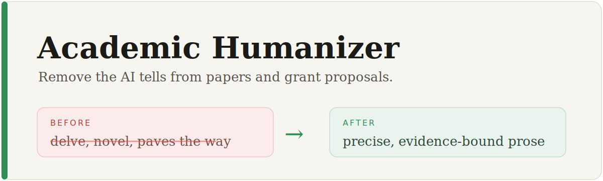

<div align="center">



[](LICENSE)
&nbsp;
&nbsp;
&nbsp;

</div>

## Why we built this

Some of us write a lot of papers and grant proposals, and our team started using AI to help with
drafts. The catch is that AI writing is easy to spot: the "In recent years..." openers, the puffed-up
phrasing, the very long sentences, the em-dashes. Reviewers pick up on it.

There are tools called "humanizers" that try to remove that AI flavor, but they're made for blogs and
marketing. Run one on a paper or an NSF proposal and it also strips out the precision and the careful,
evidence-bound wording that academic writing needs, so it ends up doing more harm than good.

So we put together our own for the group. To get the rules, we had the AI compare its own drafts with
our team's accepted papers and funded proposals, and we went through the differences by hand. It's
nothing fancy, and it isn't about gaming review or adding fake novelty. We just wanted AI-polished
drafts to still read like a person wrote them, with the numbers, citations, and claims left alone.

## See it work

> [!CAUTION]
> **Before** (AI-generated, every tell present):
>
> In recent years, continual learning has attracted increasing attention and achieved remarkable
> success. However, existing methods still face crucial challenges. In this proposal, we propose a novel
> framework that leverages cutting-edge techniques to delve into these intricate problems, paving the way
> for a transformative paradigm that will revolutionize the field.

> [!TIP]
> **After** (the AI tells are gone; the vision and ambition stay):
>
> Continual learning matters, but today's methods stay empirical and their principles are unclear. That
> limits reliability and progress. This proposal builds a principled framework on three fronts:
> adaptation, soft supervision, and cross-domain knowledge. We demonstrate it on autonomous driving and
> network management.

**More before/after passes** are in [`examples/before-after.md`](examples/before-after.md): a general
example, an NIH Specific Aims page, and a funded NSF CAREER summary.

---

## What it does

- **Removes the usual AI tells:** "paves the way", "extensive experiments", "to the best of our
  knowledge", "In recent years...", delve/underscore/tapestry, rule-of-three, very long sentences, and
  em-dashes.
- **Keeps claims tied to evidence:** no verb stronger than the data (`prove` → `show empirically`), and
  vague magnitudes become attributed ranges.
- **Leaves real scholarship alone:** evidence-tied hedging, passive voice where it fits, `we`,
  definitions, symbols, and every citation. It doesn't change a number or a reference.
- **Has a separate mode for grant proposals (NSF, NIH):** it keeps the vision a paper would trim, and
  spends most of the effort on the first pages, since that's what reviewers score.

## Install

```bash
git clone https://github.com/AIScientists-Dev/academic-humanizer ~/.claude/skills/academic-humanizer
```

It is a plain `SKILL.md` plus examples, so it also runs as a skill or system prompt for **Codex** and
**MorphMind**. Point your agent at `SKILL.md`.

## Use

```
/academic-humanizer
[paste a section, or point at main.tex]
# optionally: "match my voice from prior_paper.pdf; target venue: ICLR"
```

## How it works

Six layers: general AI-tell catalog → academic-specific tells → preserve scholarly conventions →
claim↔evidence matching → voice/venue calibration → funding-proposal mode (NSF/NIH structure,
first-page primacy, claim↔feasibility). The audit→rewrite loop is defined in [`SKILL.md`](SKILL.md).

## References

Layer 6 distills the *stable* structure of NSF and NIH proposals. For current, binding requirements
(page limits, formatting, deadlines), consult the source:

- NSF: [Proposal & Award Policies & Procedures Guide (PAPPG)](https://www.nsf.gov/policies/pappg)
- NSF: [CAREER program](https://new.nsf.gov/funding/opportunities/career-faculty-early-career-development-program)
- NIH: [Write Your Application](https://grants.nih.gov/grants/how-to-apply-application-guide/format-and-write/write-your-application.htm) (Specific Aims, Significance, Innovation, Approach)

## Acknowledgments

- **[blader/humanizer](https://github.com/blader/humanizer)** (MIT). *Focus:* removing general
  AI-writing patterns for blog, casual, and encyclopedic text. This skill reuses its general AI-tell
  catalog (Layer 1) and extends it for academic prose.
- **[koaeraser/ARMS](https://github.com/koaeraser/ARMS)**. *Focus:* an autonomous pipeline for
  statistics/methodology research papers (idea → validated, revised manuscript). A complementary,
  broader-scope project that informed the claim-evidence and numerical-precision emphasis here.

This skill is the narrower piece: a single-purpose **editing pass** that de-AI-ifies existing academic
prose and matches claims to evidence while preserving scholarly voice.

## License

MIT.
